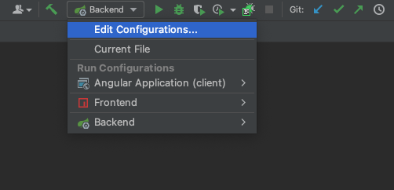
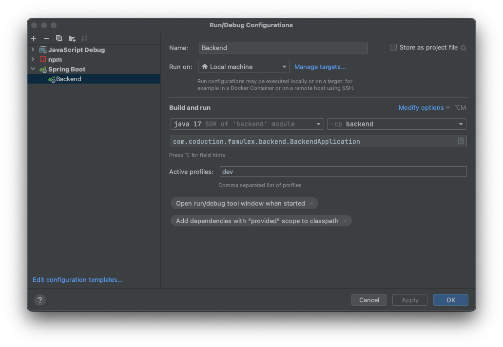
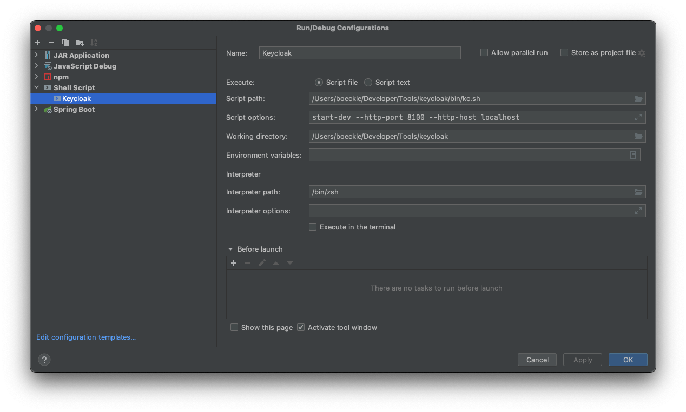
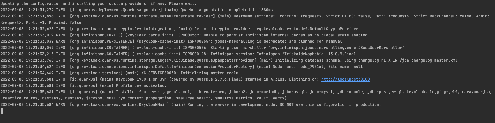
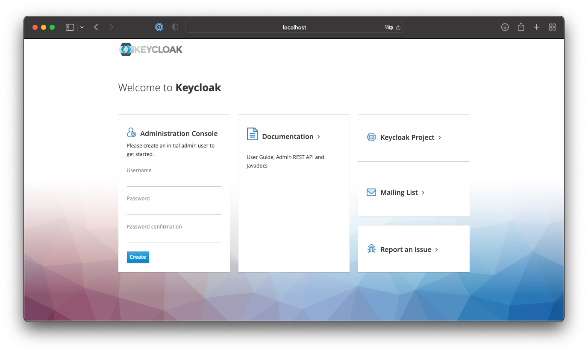
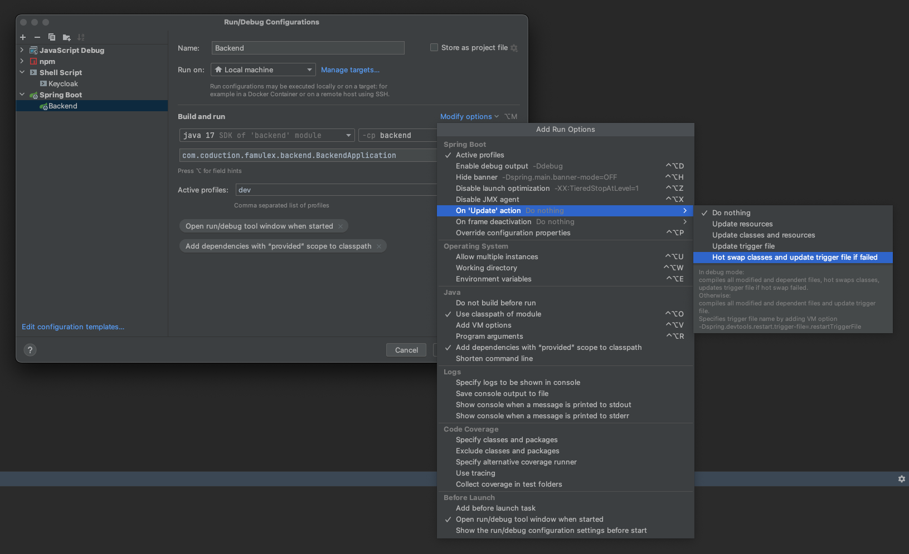
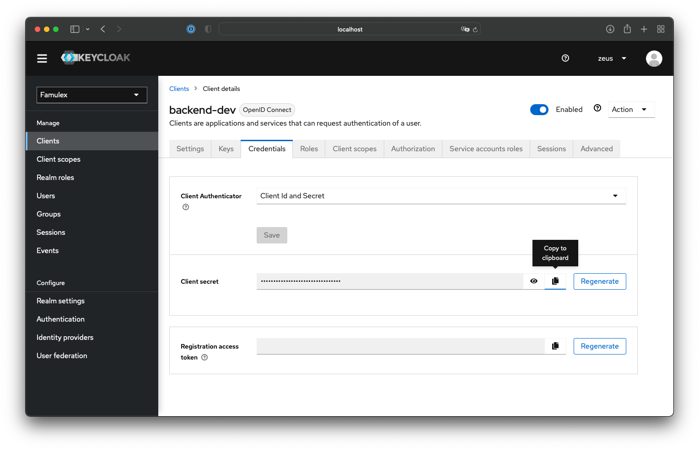
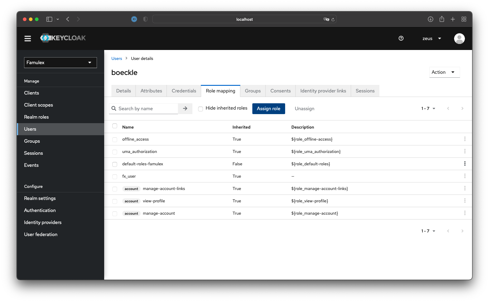
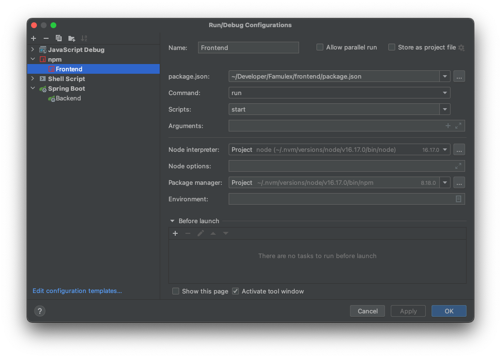

# Famulex

This learning management system is in early development. It should become an easy-to-use and beautiful tool to develop
and teach courses.  
The name is derived from the Latin _famulus_ which can be translated to _student_ and _lex_ which means _contract_.

## Development

Frontend and backend are separated and connected with a GraphQl API. Keycloak is used as an identity provider.  
It is crucial for you to set up Keycloak first in order to run the backend locally.

#### Necessary setup

Please install `Java JDK 17` and `Node v16` before continuing with the Keycloak, backend or frontend setup.

##### Java

The backend is based on `Spring Boot` and requires `Java JDK 17`.  
If working on Mac this can be easily installed via `Homebrew`. Otherwise, download it from www.adoptium.net.   
Furthermore, you should to install `Maven 3`. If you do not want or cannot install Maven you can use the Maven wrapper
which is included in this repository.
It can be used by typing ./mvnw instead of mvn. It is located in the root of this repository.

- Make sure `JDK 17` is in your `PATH`
- Execute `javac -version`
- If the output is similar to `javac 17.0.4.1` your `PATH` is set up correctly
- Mac user can use a tool called [jEnv](https://www.jenv.be) to manage Java versions
- Also check whether your IDE is configured correctly and uses `JDK 17`. This is a very likely mistake if you are using
  multiple Java versions.
- In `IntelliJ` under `File > New Projects setup > Structure...` make sure `JDK 17` is selected.

##### Node

- Install `Node v16` and `NPM 8`. NPM ships with Node included
- On a Mac you can again use `Homebrew` to install node. `brew install node@16`
- If you are dealing with different versions of node you can use [nvm](https://github.com/nvm-sh/nvm)

### Keycloak

Please download Keycloak version 19.0.1 (Quarkus distribution) from
here: [Keycloak Releases](https://www.keycloak.org/downloads)  
Extract the files, and you are ready to run your own Keycloak instance.  
The default port is 8080, which is also the port our backend is using. Therefore, we change the port of Keycloak to

8100.

#### Launch Keycloak manually

- Open a terminal and navigate to the location where you extracted Keycloak
- Run ```bin/kc.sh start-dev --http-port 8100 --http-host localhost```

#### Launch Keycloak from within IntelliJ

If you are using IntelliJ as IDE you can also follow these steps in order to easily start Keycloak when needed.

- Add a new ssh-script configuration  
  
- On the top left select the + icon and click on _Shell Script_
  
- Copy the settings as shown. Select the kc.sh file located in the bin folder where you extracted Keycloak
- Set the script options ```start-dev --http-port 8100 --http-host localhost```
- Set the working directory to where you extracted keycloak
- Remove the tick "Run in terminal"
  
- Click ```OK``` and start Keycloak
- You should see a terminal similar to this one  
  

#### Set up Keycloak

- Visit ```http://localhost:8100```     
  
- Define an administrative user
- Click on `Administration Console` and login. Reload the page if your browser gets stuck. This happens sometimes if you
  start the server and login for the first time.
- Open the dropdown in the top left corner displaying `Master` and select `Create Realm`
- Drag the file `realm_export.json` located in the folder `keycloak` into the field `Resource file` and click
  on `Create`
- Navigate to `Clients` and click on `Import client`
- Drag `frontend-dev.json` into `Resource file` and click `Save`
- Repeat the same for `backend-dev.json`

### Backend

#### Database

- Install PostgreSQL version 14
- If you are using Mac this can be done with `Homebrew` by executing `brew install postgres@14`
- Initialisation of the databse is handled by Liquibase on startup
- Create a user named `famulex` with password `famulex` and a database named `famulex`
- You can either use the commandline tool `psql` or a GUI tool like [pgAdmin](https://www.pgadmin.org)
- If you wish to specify a different user or database you can do so in `application-dev.properties`. More about that in
  a few steps.

#### Run Configuration

- Open your run configurations and modify the `Backend` configuration. If you did not change the name it might be
  called `FamulexBackend`
- Set `Active profiles` to `dev`
- Click on `Modify options` and set `On update action` to `Hot swap classes and update trigger file if failed`  
  

#### Properties file

Spring Boot offers a configuration file to adapt the application to your local needs. Please do not commit any changes
made to this file. The next steps will explain how to do it.

- Open `application-dev.properties` located under `backend/src/main/resources/application-dev.properties`
- Provide all necessary parameters which are not covered by our default values such as
  ```
  # Security settings
  keycloak.auth-server-url=http://localhost:8100
  keycloak.realm=Famulex
  keycloak.resource=backend-dev
  keycloak.credentials.secret=
  
  # Database settings (If you stick to the default values, you do not have to change those)
  spring.datasource.url=jdbc:postgresql://localhost:5432/famulex
  spring.datasource.username=famulex
  spring.datasource.password=famulex
  ```
- To tell git to ignore any changes made to this file execute the following
- Change into the `Famulex/backend`
- `git update-index --assume-unchanged src/main/resources/application-dev.properties`

#### Configure Keycloak

- Add the secret for your `Keycloak client backend-dev` to `application-properties.dev`
- Open [Keycloak](http://localhost:8100/admin/master/console/#/)
- Open the `realm Famulex`
- Go to `Clients` and open `backend-dev`
- Change to `Credentials` and copy the `client secret`  
  
- Paste it in `application-dev.properties` under `keycloak.credentials.secret=`

#### Starting the backend

- Before running it the first time or after updating the dependencies you need to install all Maven dependencies
- Change into the root of this project
- Run `mvn install`
- Select the `Backend` profile from your run configurations.
- To simply run click on the green triangle, to debug click on the bug icon

#### Create your own Famulex user

- After the server once started successfully all required roles will be imported into Keycloak.
- Afterwards go to `Realm roles` and check whether multiple roles prefixed with _fx-_ are available
- Then navigate to `Users` and create a user for yourself.
- Click on the user you just created and assign two roles. This only necessary to be done if you create users manually.
  If created via the application you do not have to worry about this.
- Select `Role mappings` and click on `Assign role`
  
- Select `fx_user` and `fx_admin`
- Click on `Assign`
- Continue with the frontend

#### GraphQL API

- A GraphQL API is exposed under the endpoint http://localhost:8080/graphql.
- If the dev profile is activated, a GraphiQl instance is provided under http://localhost:8080/graphiql. This can be
  useful to try out queries.

#### Liquibase commandline tool

- Liquibase offers a commandline tool update / rollback / drop / fill the database
- A detailed guide will follow
- Navigate to `Famulex/backend`
- Execute `git update-index --assume-unchanged src/main/resources/db/liquibase.properties` to tell git to not track any
  changes made to this file
- Please specify the `database name and user` in `src/main/resources/db/liquibase.properties`
- If you did use the default values in your database setup you do not have to change anything here
- Then execute goals as follows `mvn liquibase:update`
- Different goals are available, e.g. to roll back to a certain tag or drop the hole database

### Frontend

The frontend is based on Angular version 14.2.2.

- Install the Angular CLI _globally_ `npm install -g @angular/cli`
- If you install it globally you will be able to run commands like `ng generate component MyAwesomeComponent`
- To install all dependencies run `npm install`. Although at this point this should already be done by Maven

#### Start frontend manually

- To start the frontend manually execute `ng serve` from within in the client directory

#### Start frontend with run configuration

- If the run configuration was not detected automatically add one like this
- Click on `Edit configurations` in the menu where all your configurations are in the top right corner
- Click on `+` and select `npm` and enter the details like this  
  
- Start the frontend by selecting the `Frontend` run configuration and click on the green triangle
- To attach a debugger to the frontend do not start the frontend in debugging mode but hold `CMD` + `SHIFT` and click on
  the link displayed in the console after the frontend started
- On Windows hold `CTRL` + `SHIFT`
- Everytime you start the frontend, the graphql-codegen plugin generates services based on all GraphQL queries in any
  file ending with `*.graphql`
- It also downloads the latest documentation from the backend about the GraphQL API which gives you great autocompletion
  when developing queries and mutations
- The frontend is therefore not able to start up if the backend is not running. Always start the backend before.

#### Login to Famulex

- Open http://localhost:4200 and login

## Deployment

- To test the application how it would work in production execute `mvn package`
- Afterwards run "famulex-server-0.0.1.jar" located in the target folder of the server module
- It will serve frontend and backend combined
- Please also activate the `dev` profile for this launch configuration